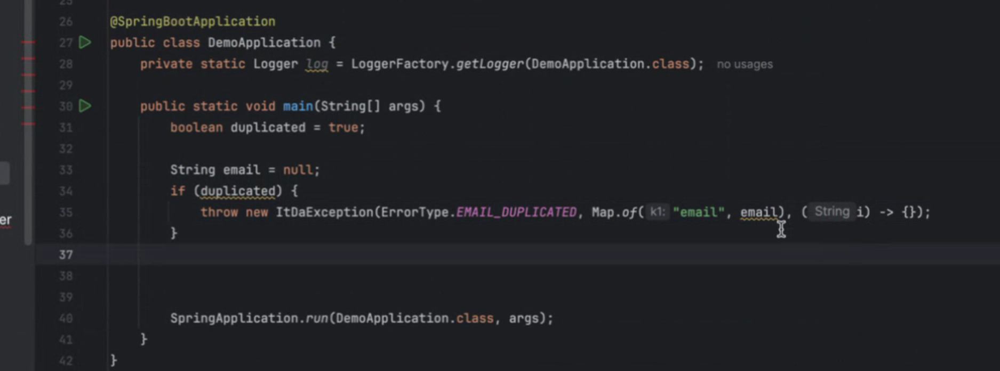

# TIL

### 오늘은 Hash 에대해서 공부하였다.

### 사용이유는 Hash 알고리즘을 사용하여 데이터 검색 성능을 O(1)으로 성능을 끌어올린다.

### HashIndex를 배열의 인덱스로 사용해서 저장하며 값은 원래의 값을 저장.

### 입력값의 범위가 넓어도 실제 모든값이 들어오지는 않음. 그래서 배열의 크기를 제한하고, 나머지 연산을 통해 메모리 낭비 방지.

## 해시 충돌

- 99, 9의 두 값은 10으로 나누면 9가 된다. 따라서 다른 값을 입력했지만 같은 해시 코드가 나오게 되는데 이것을 해시 충돌이 발생한다.
- 99 % 10 = 9
- 9 % 10 = 9

- 결과적으로 배열의 인덱스 9에는 처음에 저장한 값 99는 사라지고, 마지막에 저장한 값 9만 남게된다.

## HashIndex()

- 해시 인덱스를 반환.
- 해시 인덱스는 입력값을 계산하여 인덱스로 사용한다. 여기서 입력값을 배열의 크기로 나머지 연산해서 구함.
