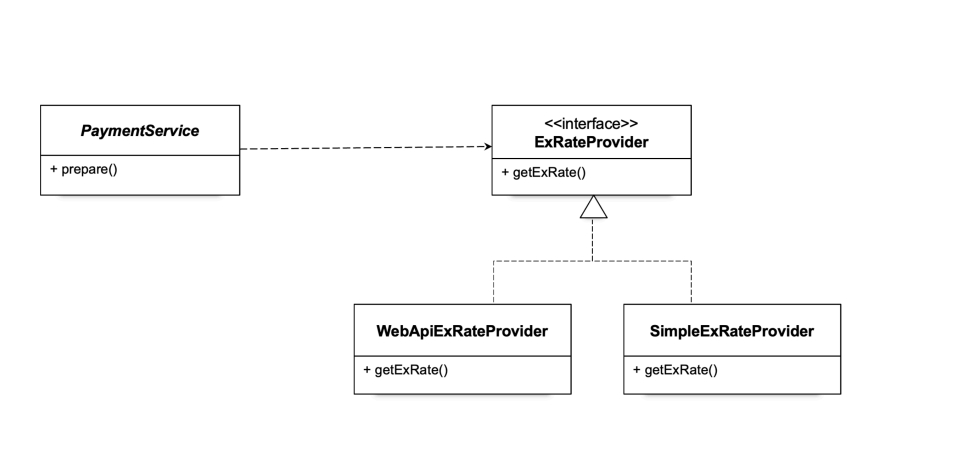

# 오늘은 MVC구조에 대해서 공부했다.

# Model

- 애플리케이션의 데이터 구조를 정의합니다.

- 데이터베이스 테이블에 매핑되는 클래스들을 포함합니다.

# View

- 사용자 인터페이스를 담당하며, 데이터의 시각적 표현을 정의합니다.

- API 서버에서는 주로 JSON 응답을 반환합니다.

# Controller

- 클라이언트로부터 요청을 받아 적절한 Service를 호출하여 응답을 반환합니다.

- HTTP 메서드(GET, POST, PUT, DELETE)에 따라 작업을 수행합니다.

# Repository

- 데이터베이스와의 상호작용을 담당하며, CRUD 연산을 처리합니다.

- 인터페이스와 클래스로 구성됩니다.

# Service

- 비즈니스 로직을 담당하며, Repository가 제공하는 메서드를 활용하여 로직을 구성합니다.

- 예를 들어 트랜잭션 관리, 복잡한 비즈니스 규칙 등을 처리합니다.

# 종속성 주입 (Dependency Injection)

- 애플리케이션 시작 시 필요한 서비스와 리포지토리를 DI 컨테이너에 등록하여, 각 구성 요소에서 의존성을 주입받아 사용할 수 있게 합니다.

### 동작 순서

1. 핸들러 조회: 핸들러 매핑을 통해 요청 URL에 매핑된 핸들러(컨트롤러)를 조회한다. (스프링은 URL 뿐만 아니라, 다른 여러가지 추가 정보(HTTP 헤더 정보 등)도 활용한다.)
2. 핸들러 어댑터 조회: 핸들러를 실행할 수 있는 핸들러 어댑터를 조회한다.
3. 핸들러 어댑터 실행: 핸들러 어댑터를 실행한다.
4. 핸들러 실행: 핸들러 어댑터가 실제 핸들러를 실행한다.
5. ModelAndView 반환: 핸들러 어댑터는 핸들러가 반환하는 정보를 ModelAndView로 변환해서 반환한다.
6. viewResolver 호출: 뷰 리졸버를 찾고 실행한다.
   JSP의 경우: InternalResourceViewResolver 가 자동 등록되고, 사용된다.
7. View 반환: 뷰 리졸버는 뷰의 논리 이름을 물리 이름으로 바꾸고, 렌더링 역할을 담당하는 뷰 객체를 반환한다.
   JSP의 경우 InternalResourceView(JstlView) 를 반환하는데, 내부에 forward() 로직이 있다.
8. 뷰 렌더링: 뷰를 통해서 뷰를 렌더링 한다.

### 핸들러 매핑

- 핸들러 매핑으로 핸들러 조회
  HandlerMapping 을 순서대로 실행해서, 핸들러를 찾는다. 이 경우 빈 이름으로 핸들러를 찾아야 하기 때문에 이름 그대로 빈 이름으로 핸들러를 찾아주는 BeanNameUrlHandlerMapping 가 실행에 성공하고 핸들러인 MyHttpRequestHandler 를 반환한다.

- 핸들러 어댑터 조회
  HandlerAdapter 의 supports() 를 순서대로 호출한다.
  HttpRequestHandlerAdapter 가 HttpRequestHandler 인터페이스를 지원하므로 대상이 된다.

- 핸들러 어댑터 실행
  디스패처 서블릿이 조회한 HttpRequestHandlerAdapter 를 실행하면서 핸들러 정보도 함께 넘겨준다.
  HttpRequestHandlerAdapter 는 핸들러인 MyHttpRequestHandler 를 내부에서 실행하고, 그 결과를 반환한다.
  정리 - MyHttpRequestHandler 핸들러 매핑, 어댑터
  MyHttpRequestHandler 를 실행하면서 사용된(적용된) 객체는 다음과 같다.
  HandlerMapping = BeanNameUrlHandlerMapping
  HandlerAdapter = HttpRequestHandlerAdapter

## 뷰 리졸버

- 스프링 부트는 애플리케이션이 띄워질 때 여러가지를 자동으로 등록하는데, 그 중에서 InternalResourceViewResolver 라는 뷰 리졸버도 자동으로 등록해준다. 이때 application.properties 에 등록한 spring.mvc.view.prefix , spring.mvc.view.suffix 설정 정보를 사용해서 등록한다.

